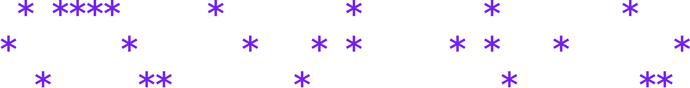
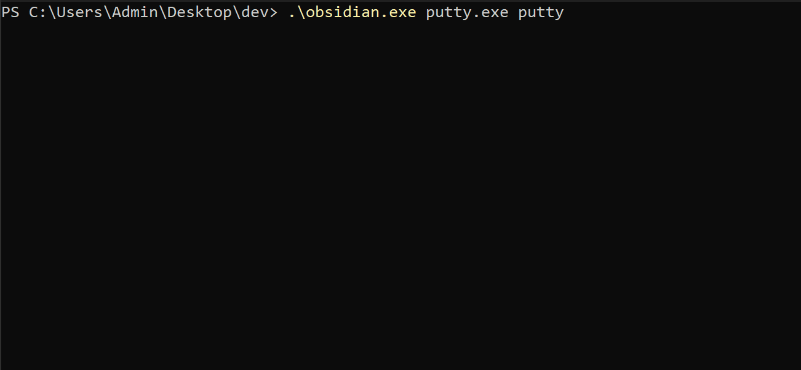
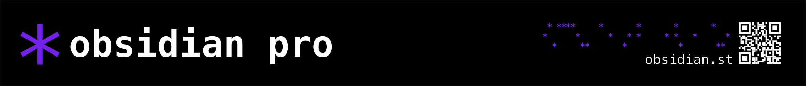
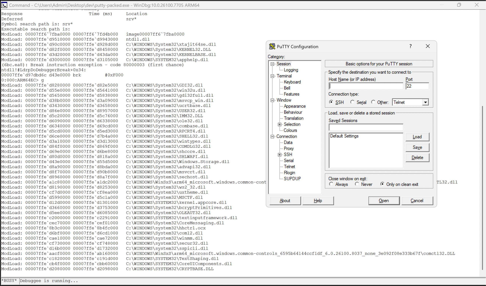
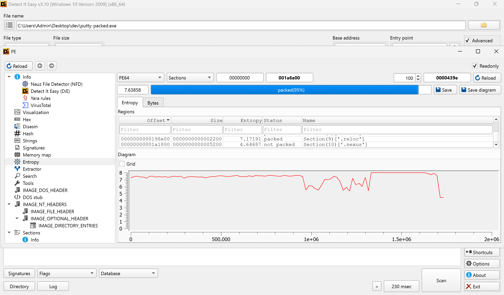
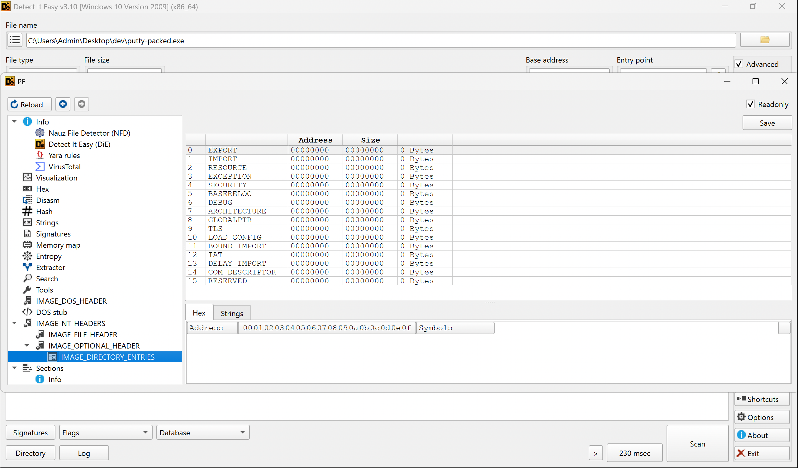

<p>
  
</p>
<p>
  <d><strong>obsidian community edition - universal pe packer</strong></d>
  <br/>
  <sup>advanced, open-source obfuscation</sup>
</p>
<p>
  <a href="https://obsidian.st/" target="_blank">
    
  </a>
  <a href="https://metrics.torproject.org/rs.html#details/714FCD4134044155A16A4EB440E30EF1F52B19B1" target="_blank">
    
  </a>
  <a href="/stub.c">
    
  </a>
</p>
<p> 
  <a href="https://obsidian.st" target="_blank">clearnet</a> • <a href="http://obsidiand244wsh2jnmqvnim2becs73dims5wc5hzse3o5ywvw6ryoyd.onion/" target="_blank">tor</a> • <a href="http://obsidian.i2p/?i2paddresshelper=edexepj4bnni4ct5otbivq73tjmyontztz5qa56qrni2rdldh4rq.b32.i2p" target="_blank">i2p</a>
</p>

---

## introduction:

obsidian is a custom universal pe packer / executable protector written in C. it is designed to be paired with a loader stub that decrypts and executes the packed payload. 

a compiled stub example is available in the stubs folder that uses rolling xor obfuscation with shifts and does not contain any anti-debugging mechanisms.

this packer/stub has been tested to work on putty.exe, strings.exe, and can even pack itself, and then pack other executables from the packed state.

every pe stub/loader gets burned the moment its source becomes public. the only way to stay ahead of this is to write your own custom one. there is an included a template for you to fill out with your own code. 

---



---

## features:

**community edition-v1.3:**
* ARM64 support now added
* improved xor algorithm
* hash-based import lookups
* compiled xorshift64+ stub (stubs/stub.bin)
* high entropy ASLR support
* stub template (BYOS - bring your own stub)
* extensive debug output (-DDEBUG & --debug flags)
* randomized config marker
* zeroed out optional headers
* secure key generation
* checksum recalculation
* pe section manipulation
* progress bar and colors

---

<a href="https://obsidian.st" target="_blank">
  
</a>

### obsidian pro available now:

obsidian pro is an upgraded version of obsidian community edition with SPECK encryption, aPlib compression, and anti-debugging syscalls. it is licensed using open-source obsidian [keykeeper](https://github.com/vertigo6622/obsidian-keykeeper) which sits behind a clearnet-to-tor proxy, enabling anonymous license management.

**where to find:**
- **clearnet:** [obsidian.st](https://obsidian.st)
- **i2p:** [obsidian.i2p](http://obsidian.i2p/?i2paddresshelper=edexepj4bnni4ct5otbivq73tjmyontztz5qa56qrni2rdldh4rq.b32.i2p)
- **tor:** `obsidiand244wsh2jnmqvnim2becs73dims5wc5hzse3o5ywvw6ryoyd.onion`

**pro edition features:**

* SPECK 128/128 CTR encryption
* aPlib compression (--compress)
* resource encryption
* extensive syscall anti-debug (--ultra)
* anti-sandbox
* hmac integrity checks
* [ollvm-22](https://github.com/vertigo6622/ollvm-22) obfuscated

---

## to-do:

**community and pro edition:**
* pyinstaller support
* remain updated to keep ahead of av detection

**commercial edition(future):**
* gui
* anti-dump protection
* license support/hardware binding
* online key provisioning
* DRM-like protections

## usage:
`.\obsidian.ce.universal.exe program.exe packed.exe`





---

## ce obfuscation engine:

```C
void obfuscate_data(uint8_t* data, size_t size, uint64_t key) {
    uint8_t key_xor_aa = (uint8_t)(key ^ 0xAA);
    uint8_t key_xor_aa_shr8 = (uint8_t)((key ^ 0xAA) >> 8);
    
    for (size_t i = 0; i < size; i++) {
        uint64_t subkey = key ^ (i * 0x9E3779B97F4A7C15ULL);
        subkey = (subkey ^ (subkey >> 30)) * 0xBF58476D1CE4E5B9ULL;
        subkey = (subkey ^ (subkey >> 27)) * 0x94D049BB133111EBULL;
        subkey = subkey ^ (subkey >> 31);
        
        uint8_t shift1 = (uint8_t)((i * 8) & 0x3F);
        uint8_t shift2 = (uint8_t)((24 + i * 8) & 0x3F);
        uint8_t shift3 = (uint8_t)((56 + i * 8) & 0x3F);
        
        uint8_t mask = (uint8_t)(subkey >> shift1)
                     ^ (uint8_t)(subkey >> shift2)
                     ^ (uint8_t)(subkey >> shift3);
        
        data[i] ^= mask;
        data[i] += key_xor_aa;
        data[i] -= key_xor_aa_shr8;
    }
}
```
**obfuscation process:**
1. use constants to derive values for add and sub operations
2. mix in 'golden ratio' constants into a subkey to increase entropy
3. generate shifts and final mask variable
4. apply transformation to data

---

## stub reference sheet:

| | stub.bin | stub.Oz.bin | stub.obfuscated.bin | stub.full.obf.bin | stub-arm64.bin |
| :--- | :--- | :--- | :--- | :--- | :--- |
| description: | no optimization | aggressive size optimization | control flow flattening + instruction substitution | fully obfuscated (bogus control flow, splitting, flattening, substitution) | arm64 variant, -O1 optimized |
| size: | 17kb | 13kb | 17kb | 57kb | 5kb |
| tools: | clang/llvm | clang/llvm + Oz | clang/llvm + Oz + [ollvm-22](https://github.com/vertigo6622/ollvm-22) | clang/llvm + Oz + [ollvm-22](https://github.com/vertigo6622/ollvm-22) | clang/llvm + O1 |
| note: | basic | smallest/fastest | balanced | largest/slowest | only available in 1.3 release (no .bin for now) |

## compile:
**requirements:** 

gcc:
* mingw64 tool suite available at `https://winlibs.com/`
* windbg or other debugger
* python interpreter for `clean.py`

llvm/clang:
* llvm 22 toolchain
* mingw64 tool suite

### commands:

**step 1: build stub object file**

gcc:
```
.\gcc.exe stub.c -o stub.o -fno-asynchronous-unwind-tables -fno-ident -fno-stack-protector
```

llvm/clang:
```
clang --target=x86_64-pc-windows-gnu \
    -I/llvm-mingw-20260311-ucrt-macos-universal/generic-w64-mingw32/include \
    -masm=intel \
    -fno-asynchronous-unwind-tables -fno-ident -fno-stack-protector -Oz \
    -c stub.c -o stub.o
```

**step 2: link and strip stub binary**

both:
```
.\ld.exe stub.o -o stub.exe -nostdlib --build-id=none -s --entry=_start
```
```
.\objcopy.exe -O binary stub.exe stub.bin
```
```
.\windres.exe resource.rc -o resource.o
```

**step 3: build obsidian ce**

gcc:
```
.\gcc.exe obsidian.c resource.o -o obsidian.exe -lbcrypt
```

llvm/clang:
```
x86_64-w64-mingw32-clang \
  -I/llvm-mingw-20260311-ucrt-macos-universal/generic-w64-mingw32/include -O1 \
  adv-crypter.c resource.o -o adv-crypter.exe -lbcrypt
```

---

<p align="center">
  <a href="https://deepwiki.com/vertigo6622/obsidian-protector"></a>
  
  <a href="/LICENSE"></a>
  
</p>
<p align="center">
  
  
  <a href="https://obsidian.st/donate" target="_blank">
    
  </a>
</p>


