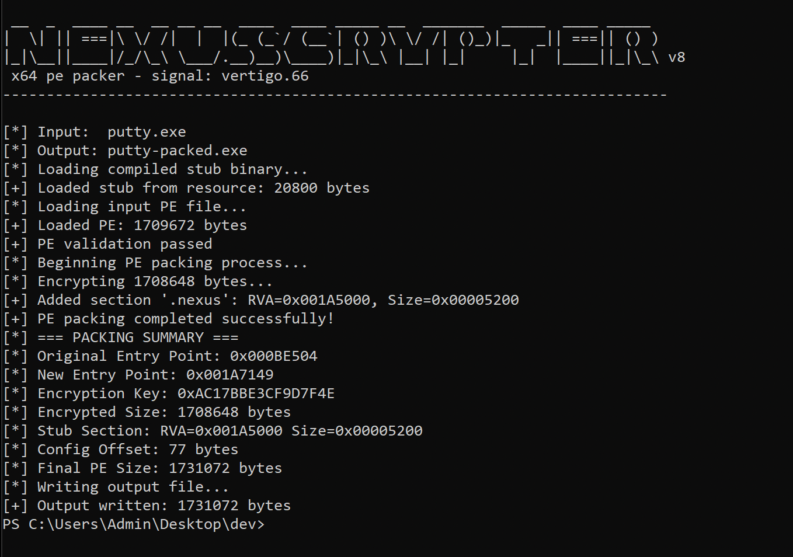

# obsidian x64 pe packer
signal: vertigo.66

## introduction:

obsidian is a custom x64 pe packer / executable protector written in C. it is designed to be paired with a loader stub that decrypts and executes the packed payload. 

a compiled stub example is available in the stubs folder. the stub uses rolling xor obfuscation with shifts and does not contain any anti-debugging mechanisms. it is NOT encryption. 

this packer/stub has been tested to work on putty.exe, strings.exe, and can even pack itself, and then pack other executables from the packed state.

every pe stub/loader gets burned the moment its source becomes public. the only way to stay ahead of this is to write your own custom one. i have included a template for you to fill out with your own code. 

## features:

**community edition:**
* basic working compiled rolling xor stub (obfuscation not encryption)
* BYOS (bring your own stub)
* stub template
* extensive debug output (-DDEBUG & --debug flags)
* randomized config marker
* zeroed out optional headers
* secure key generation
* checksum recalculation
* pe section manipulation
* progress bar and colors

**pro edition(unreleased):**

* SPECK 128/128 CTR encryption
* aPlib compression
* extensive syscall anti-debug (--ultra)
* sets mitigation policies (--ultra)

## to-do:

**community and pro edition:**
* hash-based import lookups
* pyinstaller support
* remain updated to keep ahead of av detection
* SGN encoding (pro)

**commercial edition(future):**

* license support/hardware binding
* online key provisioning
* DRM-like protections
* proper gui
* virtualization (one day...)

## usage:
`.\obsidian.exe [--debug] program.exe packed.exe`

## use-cases:

* protecting intellectual property
* preventing reverse-engineering
* ensuring licences are upheld (commercial)
* learning about PE internals
* protecting sensitive code from prying eyes

## compile:
**requirements:** 
* mingw64 tool suite available at `https://winlibs.com/`
* windbg or other debugger
* python interpreter for `clean.py`

**commands:**
* `.\gcc.exe stub.c -o stub.o [-DDEBUG] -fno-asynchronous-unwind-tables -fno-ident -fno-stack-protector`
* `.\ld.exe stub.o -o stub.exe -nostdlib --build-id=none -s --entry=_start`
* `.\objcopy.exe -O binary stub.exe stub.bin`
* `.\windres.exe resource.rc -o resource.o`
* `.\gcc.exe obsidian.c resource.o -o obsidian.exe -lbcrypt`

## license:
this software is licensed under a modified ACSL 1.4 license.

